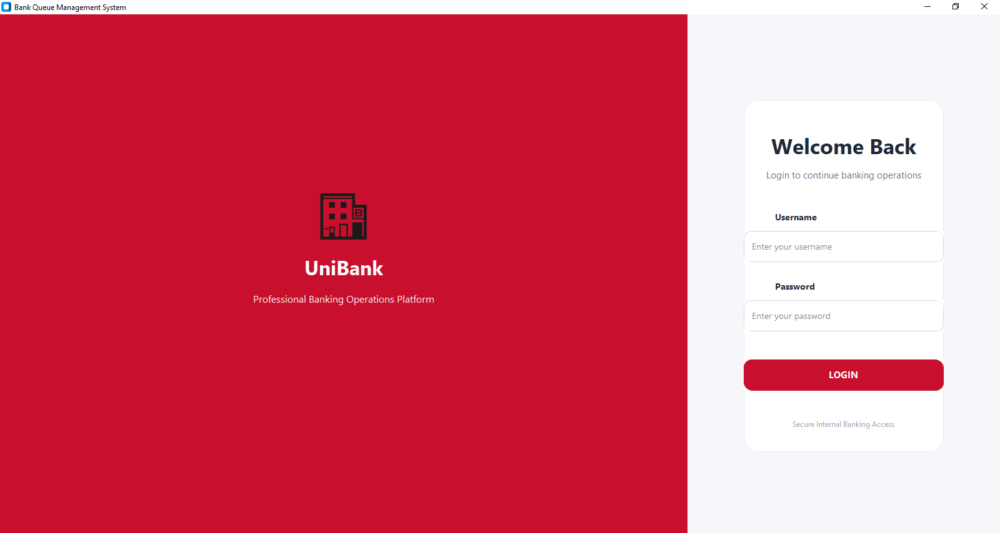
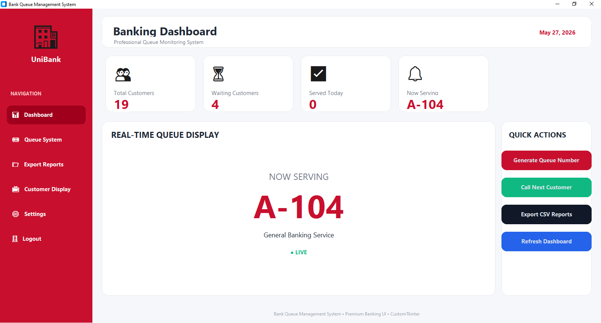
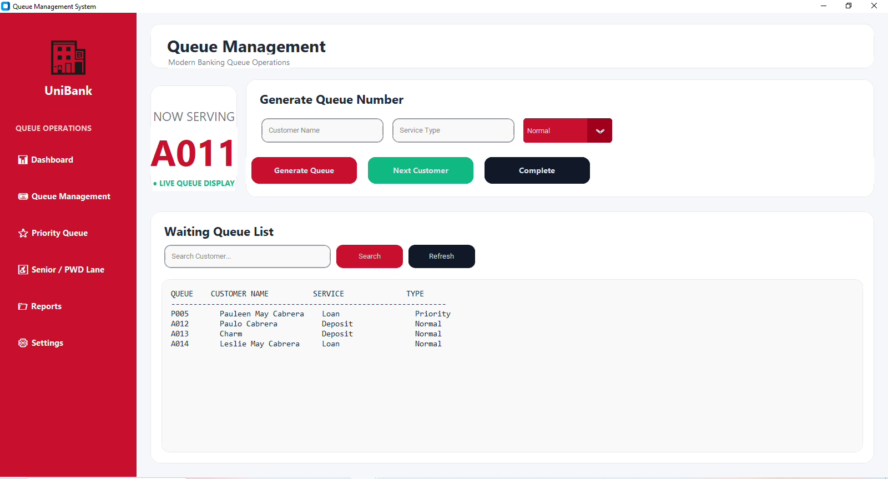
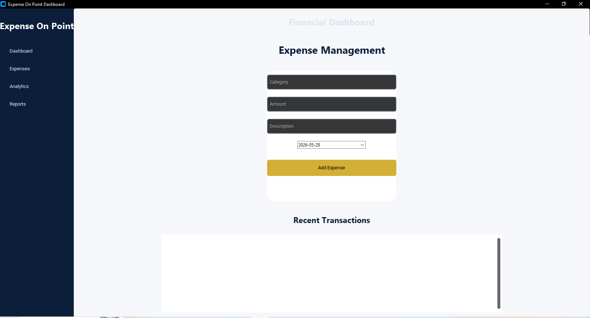

# PORTFOLIO

Paulo A. Cabrera. BS Information Technology with Specialization in Cybersecurity at Universidad de Manila  

## Featured Projects

### Bank Queue Management System

A simulation-based queue system designed to improve customer flow in a banking environment.

Repository: https://github.com/pauloacabrera/unibank_queue_management_system.git

Preview:  
  
  

Stack: Python, Tkinter / CustomTkinter  

Highlights:
- Ticket-based queue generation  
- Service counter management  
  
### Expense Tracker System

A desktop application that helps users manage income and expenses with categorized tracking and local database storage.

Repository: https://github.com/pauloacabrera/expense_tracker_system

Preview:  
  

Stack: Python, SQLite, CustomTkinter  

Highlights:
- Add, edit, and delete transactions  
- Categorized expense tracking  
- Lightweight local database system  

## Skills & Technologies

### Programming

### Databases

### Tools & Frameworks

## What I Do

- Develop applications using Python (PyCharm)
- Write and manage SQL queries using MySQL Workbench
- Build desktop-based systems with CRUD functionality
- Retrieval/Basic Database Management using MySQL Workbench
- Create UI applications using CustomTkinter
- Perform basic computer hardware and software technical support
- Troubleshoot basic network issues 
- Apply cybersecurity awareness and basic security practices

## Connect With Me

- GitHub: https://github.com/pauloacabrera  
- Portfolio: https://paulocabrera.github.io  
- Email: pauloacabreraa06@gmail.com  

### Always learning, always building
